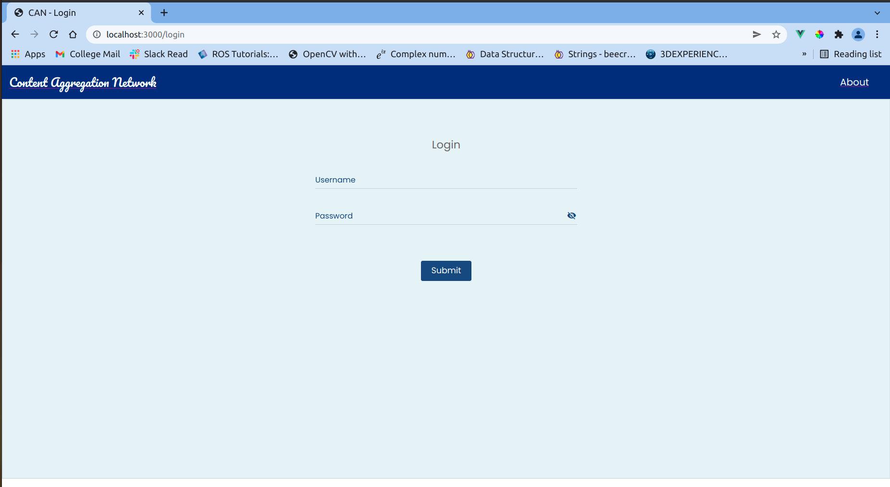

# Content Aggregation Network

Content Aggregation Network is a combination of a Flask Backend API and VueJS Frontend to provide a content management system with a focus on educational purposes.

## Quick Start

You must have npm installed on your system. This app was built on Node v16.13.2

If you see errors try using this node version.

1. Clone the repo.
```
git clone https://github.com/mostlyaman/CAN.git
```
2. Install dependencies.
```
npm install
```
3. Run dev server.
```
npm run dev
```
**Note: You must use port 3000 on localhost otherwise the frontend will not receive any data from backend and you will get CORS error in your browser console.** 

The `npm run dev` script runs the frontend on port 3000 (if available) by default. Please stop any other processes which may be using that port before running this script.

## Login Details

When you start the development server, you will see the following login page.

----------------------------------------------------------------------------------------------------------------


Right now, you can browse anonymously by just changing the URL to `/user`
I was supposed to add a **Browse Anonymously** button to the login page but I forgot that while solving some issues with Flask App.
The login page works though.
If you want to test the login page, the following credentails are registered in the Database.

**Username: mostlyaman**

**Password: aman**

## Backend

The backend API of this application is made in Python 3.9 using Flask. If you want to host the backend API by your own, you can do so by following these two steps.

1. Host the backend application `flask_app.py` on a platform of your choice. I have used PythonAnywhere. You can find the Python File in the backend directory. 
2. Change the Base URL of the API the frontend accesses in the `.env` file.

## Motivation 

Here at IIT Mandi, I have been fed up with so many different links and events I have to constantly keep track of.

Club Events are announced on Whatsapp and email. Assignments are updated on Moodle. You ask coding doubts on Slack. Professors share class links and recorded videos on email. Contact details of TAs are mailed at the start of the semester and I have to seach through my email everytime I need to find something.  I have been so upset with my management skills that I dedicate my Hack36  Project to solving this problem by making my own CMS run by students.

It is a platform where anyone can post updates to the forum in dedicated spaces, so that every information is 1-2 clicks away.

## Progress of the Project

Despite working very hard, the initial goal project had so much functionality that I could not implement all in 36 hours. 

Right now, the front end can only read posts from the backend. It cannot create a new post. This will be added soon along with other cool features like code editor implementation for coding questions, ability to comment on posts, embed youtube videos, personal messaging systems, visualization of your friends circle using graphs. This is going to be an interesting project. 
